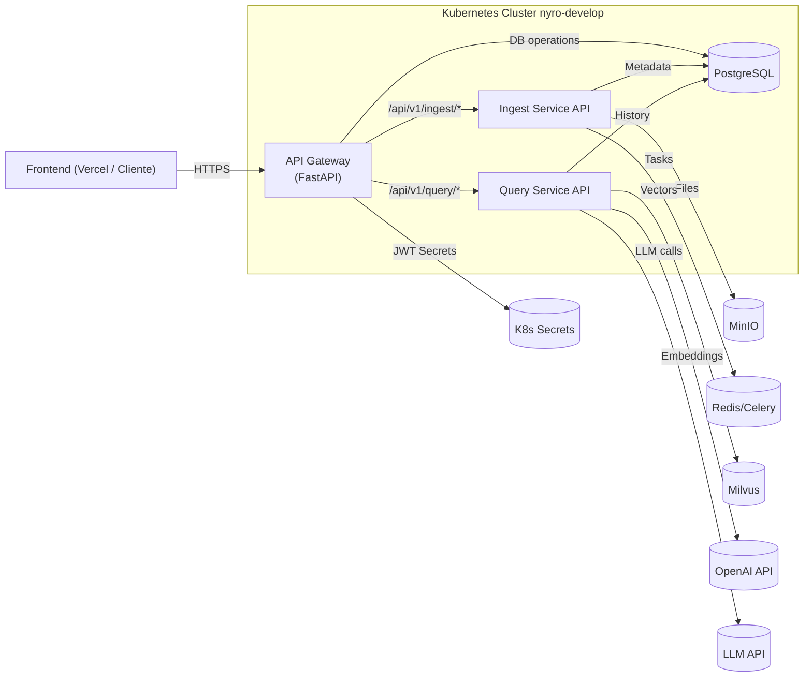

# API Gateway (api-gateway) - Atenex

## 1. Visión General

Este servicio actúa como el **API Gateway** para la plataforma SaaS B2B de Atenex. Es el punto de entrada único y seguro para todas las solicitudes externas destinadas a los microservicios backend (Ingesta, Consulta, etc.) que se ejecutan en el namespace `nyro-develop` de Kubernetes. Sus responsabilidades principales son:

*   **Routing:** Dirige las solicitudes entrantes al microservicio apropiado (`ingest-api-service`, `query-service`) dentro del namespace `nyro-develop`, basándose en la ruta de la URL (`/api/v1/ingest/*`, `/api/v1/query/*`).
*   **Autenticación y Autorización (JWT):**
    *   Verifica los tokens JWT presentados en el header `Authorization: Bearer <token>`.
    *   Valida la **firma** del token usando el secreto compartido (`GATEWAY_JWT_SECRET`).
    *   Valida la **expiración** (`exp`).
    *   Verifica la presencia de **claims requeridos** (`sub`, `exp`).
    *   **Para rutas protegidas estándar:** Extrae y **requiere** el `company_id` directamente del payload del token. Si falta o el usuario no existe/está inactivo en PostgreSQL, la solicitud es rechazada (401 Unauthorized o 403 Forbidden).
    *   **Para asociación inicial:** Proporciona un endpoint (`/api/v1/users/me/ensure-company`) que valida el token pero *no* requiere `company_id` inicialmente, permitiendo asociar uno y generando un *nuevo token* con la asociación.
    *   Proporciona un endpoint (`/api/v1/users/login`) para autenticar usuarios contra PostgreSQL y generar tokens JWT.
*   **Asociación de Compañía (Inicial):**
    *   Provee el endpoint (`POST /api/v1/users/me/ensure-company`) para que usuarios autenticados (sin `company_id` en su token o queriendo cambiarlo) puedan ser asociados a una compañía.
    *   Utiliza conexión directa a **PostgreSQL** (via `asyncpg`) para actualizar el registro del usuario con un `company_id` (ya sea uno proporcionado o el `GATEWAY_DEFAULT_COMPANY_ID`).
*   **Inyección de Headers:** Añade headers críticos a las solicitudes reenviadas a los servicios backend, basados en el payload del token validado:
    *   `X-Company-ID`: Extraído directamente del token.
    *   `X-User-ID`: Extraído del claim `sub` (Subject/User ID).
    *   `X-User-Email`: Extraído del claim `email`.
    *   `X-Request-ID`: Propaga el ID de la solicitud para tracing.
*   **Proxy Inverso:** Reenvía eficientemente las solicitudes (incluyendo cuerpo y query params) a los servicios correspondientes utilizando un cliente HTTP asíncrono (`httpx`).
*   **Centralized CORS:** Gestiona la configuración de Cross-Origin Resource Sharing (CORS) en un solo lugar.
*   **Punto de Observabilidad:** Logging estructurado (JSON), Request ID, Timing.
*   **Manejo de Errores:** Respuestas de error estandarizadas y logging de excepciones.
*   **Health Check:** Endpoint `/health` para verificaciones de estado (Kubernetes probes).

Este Gateway está diseñado para ser ligero y eficiente, enfocándose en la seguridad y el enrutamiento, y delegando la lógica de negocio a los microservicios correspondientes, pero también manejando la autenticación inicial y la lógica de asociación de compañía.

## 2. Arquitectura General del Proyecto (Posición del Gateway)



*Diagrama actualizado para reflejar PostgreSQL en el clúster y el flujo de autenticación/JWT.*

## 3. Características Clave

*   **Proxy Inverso Asíncrono:** Reenvía tráfico a `ingest-api-service` y `query-service` usando `httpx`.
*   **Autenticación y Generación JWT Interna:**
    *   Endpoint `/api/v1/users/login` para autenticar usuarios contra **PostgreSQL** (`asyncpg`, `passlib`) y generar tokens JWT (`python-jose`).
    *   Verifica tokens JWT (`python-jose`). Valida firma, expiración, claims requeridos (`sub`, `exp`). Verifica existencia/estado del usuario en **PostgreSQL**. **Requiere `company_id` en el payload del token para rutas estándar.**
*   **Asociación Inicial de Compañía:** Endpoint dedicado (`/api/v1/users/me/ensure-company`) que valida el token *sin* requerir `company_id` preexistente y usa el cliente **PostgreSQL** para actualizar el registro del usuario. Devuelve un **nuevo token JWT** con la `company_id` actualizada.
*   **Inyección de Headers de Contexto:** Añade `X-Company-ID`, `X-User-ID`, `X-User-Email` a las solicitudes downstream.
*   **Routing basado en Path:** Usa FastAPI para dirigir `/api/v1/ingest/*`, `/api/v1/query/*`, y `/api/v1/users/*`.
*   **Autenticación por Ruta:** Utiliza dependencias (`StrictAuth`, `InitialAuth`) de FastAPI para proteger rutas con diferentes requisitos.
*   **Cliente HTTP Asíncrono Reutilizable:** Gestiona un pool de conexiones `httpx` (inicializado en `lifespan`).
*   **Pool de Conexiones PostgreSQL Asíncrono:** Gestiona conexiones a PostgreSQL usando `asyncpg` (inicializado en `lifespan`).
*   **Logging Estructurado (JSON):** Logs detallados con `structlog`.
*   **Configuración Centralizada:** Carga configuración desde variables de entorno (`pydantic-settings`), prefijo `GATEWAY_`. **Incluye verificaciones críticas para secretos (JWT y PostgreSQL Password).**
*   **Middleware:** CORS, Request ID, Timing, Logging.
*   **Manejo de Errores:** Handlers globales y respuestas estandarizadas.
*   **Despliegue Contenerizado:** Dockerfile y manifests K8s listos.
*   **Health Check:** Endpoint `/health` para probes de K8s.
*   **(Opcional) Proxy de Autenticación:** Ruta `/api/v1/auth/*` si `GATEWAY_AUTH_SERVICE_URL` está configurado.

## 4. Pila Tecnológica Principal

*   **Lenguaje:** Python 3.10+
*   **Framework API:** FastAPI
*   **Cliente HTTP:** HTTPX
*   **Validación/Generación JWT:** python-jose[cryptography]
*   **Hashing Contraseñas:** passlib[bcrypt]
*   **Base de datos (Cliente):** PostgreSQL (via asyncpg)
*   **Configuración:** pydantic-settings
*   **Logging:** structlog
*   **Despliegue:** Docker, Kubernetes, Gunicorn + Uvicorn

## 5. Estructura de la Codebase

```
api-gateway/
├── app/
│   ├── __init__.py
│   ├── auth/                 # Lógica de autenticación y JWT
│   │   ├── __init__.py
│   │   ├── auth_middleware.py # Dependencias (StrictAuth, InitialAuth)
│   │   └── auth_service.py    # Lógica (verify_token, create_token, authenticate_user)
│   ├── core/                 # Configuración y Logging Core
│   │   ├── __init__.py
│   │   ├── config.py         # Settings (Pydantic)
│   │   └── logging_config.py # Configuración structlog
│   ├── db/                   # Lógica de acceso a Base de Datos
│   │   └── postgres_client.py # Funciones asyncpg (get_user, update_user, pool)
│   ├── main.py               # Entrypoint FastAPI, lifespan, middlewares, health
│   ├── routers/              # Definición de rutas
│   │   ├── __init__.py
│   │   ├── auth_router.py    # (Inactivo/Placeholder)
│   │   ├── gateway_router.py # Rutas proxy (/ingest, /query, /auth [opcional])
│   │   └── user_router.py    # Rutas de usuario (/login, /users/me/ensure-company)
│   └── utils/                # (Vacío por ahora)
├── k8s/                      # Manifests de Kubernetes
│   ├── gateway-configmap.yaml
│   ├── gateway-deployment.yaml
│   ├── gateway-secret.example.yaml # Ejemplo, NO incluir valores reales
│   └── gateway-service.yaml
│   # (Deberías tener también los manifests de PostgreSQL aquí o en otro lugar)
├── Dockerfile                # Define cómo construir la imagen Docker
├── pyproject.toml            # Dependencias (Poetry)
├── poetry.lock               # Lockfile de dependencias
└── README.md                 # Este archivo
```
*(Se eliminó `app/auth/jwt_handler.py` ya que su lógica se movió a `auth_service.py`)*

## 6. Configuración

Configuración mediante variables de entorno (prefijo `GATEWAY_`).

**Variables de Entorno Clave:**

| Variable                                | Descripción                                                                      | Ejemplo (Valor Esperado en K8s - ns: `nyro-develop`)            | Gestionado por |
| :-------------------------------------- | :------------------------------------------------------------------------------- | :--------------------------------------------------------------- | :------------- |
| `GATEWAY_LOG_LEVEL`                     | Nivel de logging (DEBUG, INFO, WARNING, ERROR).                                  | `INFO`                                                           | ConfigMap      |
| `GATEWAY_INGEST_SERVICE_URL`            | URL base del Ingest Service API.                                                 | `http://ingest-api-service.nyro-develop.svc.cluster.local:80`  | ConfigMap      |
| `GATEWAY_QUERY_SERVICE_URL`             | URL base del Query Service API.                                                  | `http://query-service.nyro-develop.svc.cluster.local:80`     | ConfigMap      |
| `GATEWAY_AUTH_SERVICE_URL`              | (Opcional) URL base del Auth Service para proxy directo.                           | `http://auth-service.nyro-develop.svc.cluster.local:80`      | ConfigMap      |
| **`GATEWAY_JWT_SECRET`**                | **Clave secreta JWT para firma y validación de tokens.**                           | *Valor secreto en el entorno*                                  | **Secret**     |
| `GATEWAY_JWT_ALGORITHM`                 | Algoritmo usado para los tokens JWT (debe coincidir con `auth_service.py`).        | `HS256`                                                          | ConfigMap      |
| **`GATEWAY_POSTGRES_PASSWORD`**         | **Contraseña para el usuario PostgreSQL.**                                         | *Valor secreto en el entorno*                                  | **Secret**     |
| `GATEWAY_POSTGRES_USER`                 | Usuario para conectar a PostgreSQL.                                              | `postgres` (o el que uses)                                       | ConfigMap      |
| `GATEWAY_POSTGRES_SERVER`               | Host/Service name del servidor PostgreSQL en K8s.                                | `postgresql.nyro-develop.svc.cluster.local`                    | ConfigMap      |
| `GATEWAY_POSTGRES_PORT`                 | Puerto del servidor PostgreSQL.                                                  | `5432`                                                           | ConfigMap      |
| `GATEWAY_POSTGRES_DB`                   | Nombre de la base de datos PostgreSQL.                                           | `atenex` (o la que uses)                                         | ConfigMap      |
| `GATEWAY_DEFAULT_COMPANY_ID`            | UUID de la compañía por defecto a asignar si falta y no se especifica.           | *UUID válido de una compañía* o vacío                            | ConfigMap      |
| `GATEWAY_HTTP_CLIENT_TIMEOUT`           | Timeout (segundos) para llamadas HTTP downstream.                                | `60`                                                             | ConfigMap      |
| `GATEWAY_HTTP_CLIENT_MAX_CONNECTIONS`   | Máximo número total de conexiones HTTP salientes.                                | `200`                                                            | ConfigMap      |
| `GATEWAY_HTTP_CLIENT_MAX_KEEPALIVE_CONNECTIONS` | Máximo número de conexiones HTTP keep-alive.                             | `100`                                                            | ConfigMap      |
| `VERCEL_FRONTEND_URL`                   | (Opcional) URL del frontend Vercel para CORS.                                    | `https://atenex-frontend.vercel.app`                           | ConfigMap/Env  |
| `PORT`                                  | Puerto interno del contenedor (Gunicorn/Uvicorn).                                | `8080`                                                           | Dockerfile/Deployment |

**¡ADVERTENCIAS DE SEGURIDAD IMPORTANTES!**

*   **`GATEWAY_JWT_SECRET`:** Debe ser una clave secreta fuerte y única. Gestionar vía K8s Secret (`atenex-api-gateway-secrets`).
*   **`GATEWAY_POSTGRES_PASSWORD`:** Contraseña de la base de datos. Gestionar vía K8s Secret (`atenex-api-gateway-secrets`).
*   **`GATEWAY_DEFAULT_COMPANY_ID`:** Si se establece, debe ser un UUID válido correspondiente a una compañía real en tu tabla `COMPANIES`.

**Kubernetes (Namespace: `nyro-develop`):**

*   Configuración general -> `atenex-api-gateway-config` (ConfigMap).
*   Secretos (`GATEWAY_JWT_SECRET`, `GATEWAY_POSTGRES_PASSWORD`) -> `atenex-api-gateway-secrets` (Secret).
*   Ambos deben existir en el namespace `nyro-develop`.

## 7. Flujo de Autenticación y Asociación de Compañía

Este Gateway implementa flujos clave basados en JWT y PostgreSQL:

**A) Login (`POST /api/v1/users/login`):**

1.  **Solicitud del Cliente:** Frontend envía `email` y `password`.
2.  **Recepción y Autenticación:** Gateway recibe la solicitud. El endpoint llama a `authenticate_user` (`auth_service.py`).
3.  **Verificación DB:** `authenticate_user` llama a `get_user_by_email` (`postgres_client.py`) para buscar al usuario.
4.  **Verificación Contraseña:** Si el usuario existe y está activo, `authenticate_user` usa `verify_password` (`passlib`) para comparar el hash de la contraseña.
5.  **Generación JWT:** Si las credenciales son válidas, `login_for_access_token` llama a `create_access_token` (`auth_service.py`) para generar un JWT. El token incluye `sub` (user ID), `email`, `exp`, `iat`, y `company_id` (si el usuario ya tiene uno en la DB).
6.  **Respuesta:** El gateway devuelve el `access_token` y datos básicos del usuario.

**B) Validación Estándar (Rutas Protegidas como `/ingest`, `/query`):**

1.  **Solicitud del Cliente:** Frontend envía request con `Authorization: Bearer <token_con_company_id>`.
2.  **Recepción y Extracción:** Gateway recibe la solicitud. La dependencia `StrictAuth` (`auth_middleware.py`) se activa.
3.  **Validación del Token (`verify_token` con `require_company_id=True`):**
    *   Verifica firma, expiración, claims (`sub`, `exp`).
    *   Busca y **requiere** `company_id` directamente en el payload del token. Si falta -> **403 Forbidden**.
    *   Verifica que el usuario (`sub`) exista y esté activo en **PostgreSQL** (llama a `get_user_by_id`). Si no existe/inactivo -> **401 Unauthorized**.
    *   Si todo OK, devuelve el payload (incluyendo `company_id`).
4.  **Inyección y Proxy:** El router (`gateway_router.py`) extrae `X-User-ID`, `X-Company-ID`, `X-User-Email` del payload y los inyecta en la solicitud antes de reenviarla al servicio backend correspondiente.

**C) Asociación/Confirmación de Compañía (`POST /api/v1/users/me/ensure-company`):**

1.  **Contexto:** El frontend (después del login) necesita asegurar que el usuario esté asociado a una compañía (o quiere cambiarla opcionalmente).
2.  **Solicitud del Cliente:** Frontend envía `POST /api/v1/users/me/ensure-company` con el token JWT actual (puede o no tener `company_id`). Opcionalmente, puede incluir `{ "company_id": "uuid-a-asignar" }` en el body.
3.  **Recepción y Extracción:** Gateway recibe la solicitud. La dependencia `InitialAuth` (`auth_middleware.py`) se activa.
4.  **Validación del Token (`verify_token` con `require_company_id=False`):**
    *   Verifica firma, expiración, claims (`sub`, `exp`). Verifica existencia/estado del usuario en **PostgreSQL**.
    *   **NO requiere** `company_id` en el token. Si el token es válido por lo demás, devuelve el payload.
5.  **Lógica del Endpoint (`ensure_company_association` en `user_router.py`):**
    *   Obtiene el `user_id` (`sub`) del payload.
    *   Obtiene datos actuales del usuario de PostgreSQL.
    *   Determina el `company_id` a asignar:
        *   Prioridad 1: El `company_id` del body (si se proporcionó).
        *   Prioridad 2: El `GATEWAY_DEFAULT_COMPANY_ID` (si el usuario no tiene uno y no se proporcionó en el body).
        *   Prioridad 3: La `company_id` actual del usuario (si ya tiene una y no se proporcionó otra).
        *   Error si ninguna de las anteriores aplica.
    *   Si el `company_id` determinado es diferente al actual del usuario, llama a `update_user_company` (`postgres_client.py`) para actualizar la base de datos.
    *   Llama a `create_access_token` para generar un **NUEVO token JWT** que incluya la `company_id` final.
6.  **Respuesta al Cliente:** Devuelve 200 OK con un mensaje, los IDs y el **nuevo token JWT**.
7.  **Acción Frontend:** El frontend **debe** almacenar y usar este **nuevo token** para futuras llamadas, ya que ahora contiene la `company_id` correcta.

## 8. API Endpoints

*   **`GET /`**
    *   **Descripción:** Endpoint raíz.
    *   **Autenticación:** No requerida.
    *   **Respuesta:** `{"message": "Atenex API Gateway is running!"}`

*   **`GET /health`**
    *   **Descripción:** Health Check (K8s probes).
    *   **Autenticación:** No requerida.
    *   **Respuesta OK (200):** `{"status": "healthy", "service": "Atenex API Gateway"}`
    *   **Respuesta Error (503):** (Si se implementa chequeo de dependencias) Si alguna dependencia crítica no está lista.

*   **`POST /api/v1/users/login`**
    *   **Descripción:** Autentica al usuario con email/password contra PostgreSQL.
    *   **Autenticación:** No requerida (se envían credenciales en el body).
    *   **Cuerpo (Request):** `{ "email": "user@example.com", "password": "user_password" }`
    *   **Respuesta OK (200):** `LoginResponse` (incluye `access_token`, `user_id`, `email`, `company_id` si existe).
    *   **Respuesta Error:** 401 (Credenciales inválidas/usuario inactivo).

*   **`POST /api/v1/users/me/ensure-company`**
    *   **Descripción:** Asocia/Confirma una `company_id` para el usuario autenticado. Usa `company_id` del body o la default. Actualiza la DB y genera un nuevo token.
    *   **Autenticación:** **Requerida (InitialAuth).** Token JWT válido (firma, exp, usuario existe), pero **no** requiere `company_id` preexistente en el *token de entrada*.
    *   **Cuerpo (Request Opcional):** `{ "company_id": "uuid-de-compania-especifica" }`
    *   **Respuesta OK (200):** `EnsureCompanyResponse` (incluye `user_id`, `company_id` final, mensaje, y `new_access_token`).
    *   **Respuesta Error:** 400 (Falta `company_id` si es necesario y no hay default), 401 (Token inválido/ausente), 403 (No debería ocurrir aquí), 404 (Usuario del token no en DB), 500 (Error DB o al generar token).

*   **`/api/v1/ingest/{endpoint_path:path}` (Proxy genérico)**
    *   **Métodos:** `GET`, `POST`, `PUT`, `DELETE`, `PATCH`, `OPTIONS`
    *   **Descripción:** Reenvía solicitudes a Ingest Service (`ingest-api-service.nyro-develop.svc.cluster.local:80`).
    *   **Autenticación:** **Requerida (StrictAuth).** Inyecta `X-Company-ID` y `X-User-ID`.

### Ingest Service Proxy - Document State & Retry
*   **GET `/api/v1/ingest/status/{document_id}`**
    *   **Descripción:** Proxy al endpoint de estado individual de Ingest Service.
    *   **Headers:** `X-Company-ID` (UUID) requerido.
    *   **Respuesta (`200 OK`):** JSON con campos:
        ```json
        {
          "document_id": "uuid",
          "status": "processed|processing|uploaded|error",
          "file_name": "...",
          "file_type": "...",
          "chunk_count": 123,            // Valor en PostgreSQL
          "minio_exists": true,          // Flag real en MinIO
          "milvus_chunk_count": 120,     // Conteo real en Milvus
          "last_updated": "2025-...Z",
          "message": "..."            // Mensaje descriptivo
        }
        ```
*   **GET `/api/v1/ingest/status`**
    *   **Descripción:** Proxy al listado paginado de estados en Ingest Service.
    *   **Headers:** `X-Company-ID` (UUID) requerido.
    *   **Query Params:** `limit`, `offset`.
    *   **Respuesta (`200 OK`):** Lista de objetos con al menos `document_id`, `status`, `chunk_count`, `minio_exists`.
*   **POST `/api/v1/ingest/retry/{document_id}`**
    *   **Descripción:** Reintenta la ingesta de un documento en estado `error`.
    *   **Headers:** `X-Company-ID`, `X-User-ID` (UUID) requeridos.
    *   **Respuesta (`202 Accepted`):** JSON:
        ```json
        {
          "document_id": "uuid",
          "task_id": "uuid-celery",
          "status": "processing",
          "message": "Reintento de ingesta encolado correctamente."
        }
        ```

*   **`/api/v1/query/{path:path}` (Proxy Específico y Rutas Relacionadas)**
    *   **Ejemplos:** `/api/v1/query/chats`, `/api/v1/query`, `/api/v1/query/chats/{chat_id}/messages`
    *   **Métodos:** `GET`, `POST`, `DELETE`, `OPTIONS` (según ruta específica)
    *   **Descripción:** Reenvía al `Query Service` (`query-service.nyro-develop...`).
    *   **Autenticación:** **Requerida (StrictAuth).**
    *   **Headers Inyectados:** `X-Company-ID`, `X-User-ID`, `X-User-Email`, `X-Request-ID`.

*   **`/api/v1/auth/{endpoint_path:path}` (Proxy Opcional)**
    *   **Métodos:** Todos
    *   **Descripción:** (Si `GATEWAY_AUTH_SERVICE_URL` está configurado) Reenvía al servicio de autenticación externo.
    *   **Autenticación:** **No requerida por el Gateway.**
    *   **Headers Inyectados:** Ninguno (aparte de los `X-Forwarded-*`).
    *   **Si no está configurado:** Devuelve `404 Not Found`.

## 9. Ejecución Local (Desarrollo)

1.  Instalar Poetry.
2.  Clonar repo, `cd api-gateway`.
3.  `poetry install`
4.  Crear archivo `.env` en `api-gateway/` con variables **locales**:
    ```dotenv
    # api-gateway/.env

    GATEWAY_LOG_LEVEL=DEBUG

    # URLs de servicios locales (ajustar puertos si es necesario)
    GATEWAY_INGEST_SERVICE_URL="http://localhost:8001" # O URL del servicio ingest local
    GATEWAY_QUERY_SERVICE_URL="http://localhost:8002" # O URL del servicio query local
    # GATEWAY_AUTH_SERVICE_URL="http://localhost:8000" # Si tienes un servicio de auth local

    # --- Configuración JWT (¡IMPORTANTE!) ---
    # Usa una clave secreta fuerte para desarrollo, pero NO la de producción
    GATEWAY_JWT_SECRET="una-clave-secreta-muy-fuerte-para-desarrollo-local-1234567890"
    GATEWAY_JWT_ALGORITHM="HS256"

    # --- Configuración PostgreSQL Local (¡IMPORTANTE!) ---
    # Asume que tienes PostgreSQL corriendo localmente (quizás en Docker)
    GATEWAY_POSTGRES_USER="postgres" # Usuario de tu PG local
    GATEWAY_POSTGRES_PASSWORD="tu_password_de_pg_local" # <-- TU CONTRASEÑA LOCAL
    GATEWAY_POSTGRES_SERVER="localhost" # O la IP/hostname de tu contenedor PG
    GATEWAY_POSTGRES_PORT=5432
    GATEWAY_POSTGRES_DB="atenex" # Nombre de la DB local

    # ID de Compañía por defecto (Necesitas crear esta compañía en tu DB local)
    GATEWAY_DEFAULT_COMPANY_ID="un-uuid-valido-de-compania-en-tu-db-local" # <-- UUID VÁLIDO LOCAL

    # HTTP Client (Opcional)
    GATEWAY_HTTP_CLIENT_TIMEOUT=60
    GATEWAY_HTTP_CLIENT_MAX_CONNECTIONS=100
    GATEWAY_HTTP_CLIENT_MAX_KEEPALIVE_CONNECTIONS=20

    # CORS (Opcional para desarrollo local)
    VERCEL_FRONTEND_URL="http://localhost:3000"
    # NGROK_URL="https://<id>.ngrok-free.app"
    ```
5.  Asegúrate de que tu PostgreSQL local esté corriendo, tenga la base de datos `atenex`, el usuario `postgres` (o el que configures) con la contraseña correcta, y las tablas definidas en el esquema. Asegúrate de insertar al menos una compañía con el UUID que pusiste en `GATEWAY_DEFAULT_COMPANY_ID`.
6.  Ejecutar Uvicorn con reload:
    ```bash
    poetry run uvicorn app.main:app --host 0.0.0.0 --port 8080 --reload
    ```
7.  Gateway disponible en `http://localhost:8080`.

## 10. Despliegue

*   **Docker:**
    1.  `docker build -t ghcr.io/tu-org/atenex-api-gateway:$(git rev-parse --short HEAD) .` (Ejemplo de tag con hash git)
    2.  `docker push ghcr.io/tu-org/atenex-api-gateway:$(git rev-parse --short HEAD)`

*   **Kubernetes (Namespace: `nyro-develop`):**
    1.  Asegurar namespace `nyro-develop` existe: `kubectl create namespace nyro-develop` (si no existe).
    2.  **Crear/Actualizar Secretos:** Crear `atenex-api-gateway-secrets` en `nyro-develop` con los valores **reales** de producción para `GATEWAY_JWT_SECRET` y `GATEWAY_POSTGRES_PASSWORD`. **¡NO COMMITEAR VALORES REALES!**
        ```bash
        kubectl create secret generic atenex-api-gateway-secrets \
          --namespace nyro-develop \
          --from-literal=GATEWAY_JWT_SECRET='TU_CLAVE_SECRETA_JWT_DE_PRODUCCION_MUY_SEGURA' \
          --from-literal=GATEWAY_POSTGRES_PASSWORD='LA_CONTRASEÑA_REAL_DE_POSTGRES_EN_PRODUCCION' \
          --dry-run=client -o yaml | kubectl apply -f -
        ```
        *(Reemplaza los placeholders con tus claves reales)*
    3.  **Aplicar Manifests:**
        ```bash
        # Asegúrate que configmap.yaml tenga las URLs correctas y GATEWAY_DEFAULT_COMPANY_ID válido
        kubectl apply -f k8s/gateway-configmap.yaml -n nyro-develop
        # El secreto ya fue creado/actualizado
        # Asegúrate que deployment.yaml tiene la imagen correcta (tu CI/CD debería hacer esto)
        kubectl apply -f k8s/gateway-deployment.yaml -n nyro-develop
        kubectl apply -f k8s/gateway-service.yaml -n nyro-develop
        ```
    4.  Verificar pods (`kubectl get pods -n nyro-develop`), servicio (`kubectl get svc -n nyro-develop`) y logs (`kubectl logs -f <pod-name> -n nyro-develop`).

## 11. TODO / Mejoras Futuras

*   **Rate Limiting.**
*   **Tracing Distribuido (OpenTelemetry).**
*   **Caching (ej. para configuraciones o datos poco cambiantes).**
*   **Tests de Integración** (cubriendo login, proxy, ensure-company).
*   **Manejo de Errores más Refinado** (códigos de error específicos).
*   **Refrescar Tokens JWT.**
*   **Lógica más robusta para determinar `company_id`** en `ensure-company` (ej., basado en invitaciones, dominio de email).
*   **Validación más estricta de `company_id`** (verificar que la compañía exista en la DB antes de asignarla en `ensure-company`).