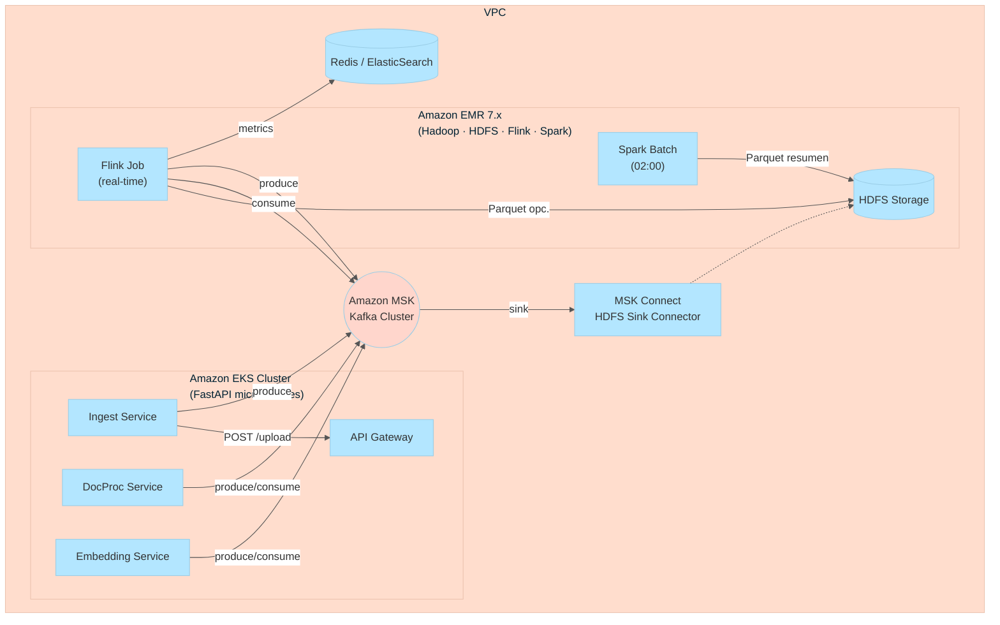

# DIAGRAMA general

```mermaid
%%{init: { 'theme':'base',
           'themeVariables': { 'primaryColor':'#b3e6ff',
                               'edgeLabelBackground':'#ffffff',
                               'lineColor':'#555' }}}%%
flowchart LR
  subgraph VPC
    direction LR

    %%–– Clúster de microservicios
    subgraph EKS["Amazon EKS Cluster\n(FastAPI microservices)"]
      direction TB
      Ingest[Ingest Service]
      DocProc[DocProc Service]
      EmbedSvc[Embedding Service]
      APIGW[API Gateway]
      Ingest -->|POST /upload| APIGW
    end

    %%–– Plataforma de mensajería
    MSK((Amazon MSK\nKafka Cluster))
    Connect["MSK Connect\nHDFS Sink Connector"]

    %%–– Clúster de datos
    subgraph EMR["Amazon EMR 7.x\n(Hadoop · HDFS · Flink · Spark)"]
      direction TB
      HDFS[(HDFS Storage)]
      FlinkRT["Flink Job\n(real-time)"]
      SparkBatch["Spark Batch\n(02:00)"]
      FlinkRT -->|Parquet opc.| HDFS
      SparkBatch -->|Parquet resumen| HDFS
    end

    Redis[(Redis / ElasticSearch)]
  end

  %%–– flujos Kafka
  Ingest -- produce --> MSK
  DocProc -- produce/consume --> MSK
  EmbedSvc -- produce/consume --> MSK
  FlinkRT -- consume --> MSK
  FlinkRT -- produce --> MSK
  MSK -- sink --> Connect -.-> HDFS

  %%–– métricas tiempo real
  FlinkRT -- metrics --> Redis

  classDef topic fill:#ffd6cc;
  class MSK topic


```