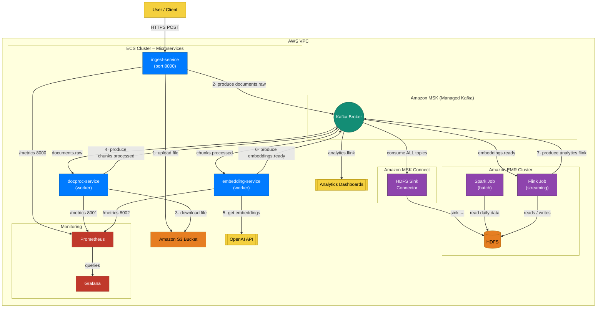

# DIAGRAMA general

```mermaid
---
id: d9f72867-e281-4190-86f1-d6590dc1318b
---
%%{
  init: {
    "theme": "base",
    "themeVariables": {
      /*  ─── Colores base del diagrama ─────────────────────────── */
      "primaryColor":       "#154360",   /* azul muy oscuro p/ bordes de clúster */
      "primaryTextColor":   "#FFFFFF",
      "primaryBorderColor": "#154360",
      "lineColor":          "#1A5276",   /* azul intermedio → buenas flechas   */
      "secondaryColor":     "#F8F9F9",  /* gris muy claro → fondo clúster     */
      "tertiaryColor":      "#D5DBDB",
      "edgeLabelBackground":"#FDF2E9",  /* beige suave → los textos flotan     */
      "clusterBkg":         "#FBFCFD"   /* fondo dentro de clústeres           */
    }
  }
}%%

graph TD
    linkStyle default stroke-width:1.5px

    %% ─────────── DEFINICIÓN DE CLASES (altos contraste) ───────────
    classDef microservice fill:#007BFF,stroke:#0B5394,color:#FFFFFF
    classDef datastore   fill:#E67E22,stroke:#9C640C,color:#000000
    classDef broker      fill:#138D75,stroke:#0B5345,color:#FFFFFF
    classDef bigdata     fill:#8E44AD,stroke:#512E5F,color:#FFFFFF
    classDef monitoring  fill:#C0392B,stroke:#922B21,color:#FFFFFF
    classDef external    fill:#F4D03F,stroke:#B7950B,color:#000000

    %% ─────────── ACTOR ───────────
    User[<fa:fa-user> User / Client]:::external

    %% ─────────── AWS VPC ───────────
    subgraph AWS_VPC["AWS VPC"]
      direction TB

      %% Amazon MSK
      subgraph MSK["Amazon MSK (Managed Kafka)"]
        direction TB
        Kafka((<fa:fa-random> Kafka Broker)):::broker
      end

      %% MSK Connect
      subgraph MSK_Connect["Amazon MSK Connect"]
        HDFSSink["HDFS Sink<br/>Connector"]:::bigdata
      end

      %% ECS / Fargate
      subgraph ECS["ECS Cluster – Microservices"]
        direction LR
        Ingest["ingest-service<br/>(port&nbsp;8000)"]:::microservice
        DocProc["docproc-service<br/>(worker)"]:::microservice
        EmbedSvc["embedding-service<br/>(worker)"]:::microservice
      end

      %% EMR
      subgraph EMR_Cluster["Amazon EMR Cluster"]
        direction TB
        Flink["Flink Job<br/>(streaming)"]:::bigdata
        Spark["Spark Job<br/>(batch)"]:::bigdata
        HDFS[(<fa:fa-database> HDFS)]:::datastore
      end

      %% Monitoring
      subgraph Monitoring["Monitoring"]
        direction LR
        Prom[<fa:fa-chart-bar> Prometheus]:::monitoring
        Graf[<fa:fa-chart-area> Grafana]:::monitoring
      end

      %% Almacenamiento y externos
      S3[<fa:fa-aws> Amazon S3 Bucket]:::datastore
      OpenAI[[<fa:fa-cloud> OpenAI API]]:::external
      Dashboards[[<fa:fa-tv> Analytics Dashboards]]:::external
    end

    %% ─────────── FLUJOS ───────────
    %% Ingesta
    User   -- "HTTPS POST"                  --> Ingest
    Ingest -- "1· upload file"              --> S3
    Ingest -- "2· produce documents.raw"    --> Kafka

    %% Procesamiento de documento
    Kafka    -- "documents.raw"               --> DocProc
    DocProc  -- "3· download file"            --> S3
    DocProc  -- "4· produce chunks.processed" --> Kafka

    %% Embeddings
    Kafka    -- "chunks.processed"            --> EmbedSvc
    EmbedSvc -- "5· get embeddings"           --> OpenAI
    EmbedSvc -- "6· produce embeddings.ready" --> Kafka

    %% Streaming Analytics
    Kafka  -- "embeddings.ready"            --> Flink
    Flink  -- "7· produce analytics.flink"   --> Kafka
    Kafka  -- "analytics.flink"             --> Dashboards

    %% Persistencia
    Kafka     -- "consume ALL topics" --> HDFSSink
    HDFSSink  -- "sink →"             --> HDFS
    Spark     -- "read daily data"    --> HDFS
    Flink     -- "reads / writes"     --> HDFS

    %% Monitoring
    Ingest   -- "/metrics 8000" --> Prom
    DocProc  -- "/metrics 8001" --> Prom
    EmbedSvc -- "/metrics 8002" --> Prom
    Prom     -- "queries"       --> Graf
```