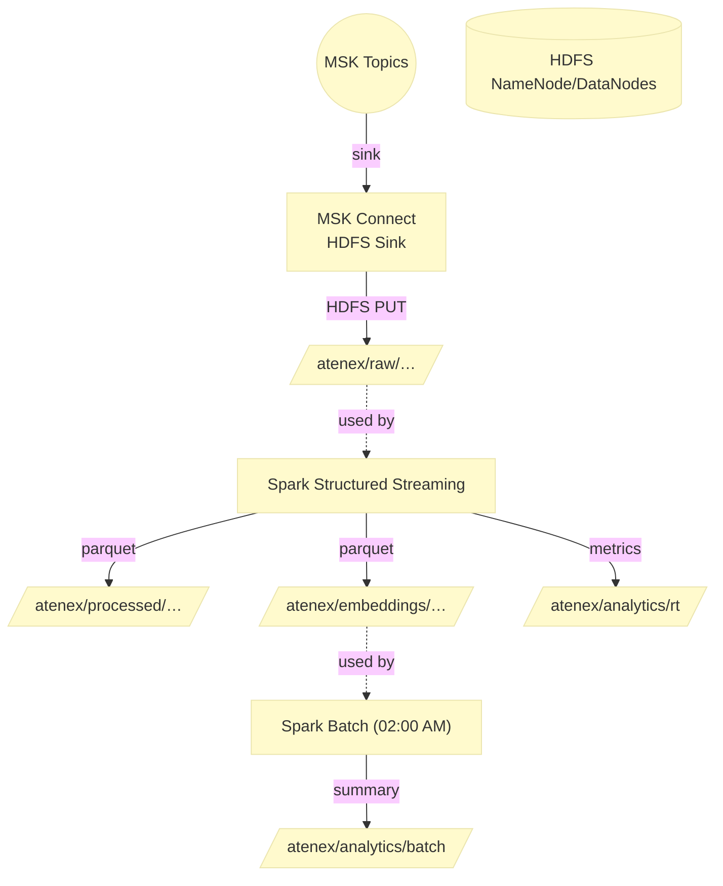

# Diagrama hdfs

```mermaid
%%{init: { 'theme':'base', 'themeVariables': { 'primaryColor':'#fffacd', 'lineColor':'#333' }}}%%
flowchart TD
  MSK((MSK Topics))
  HdfsSink["MSK Connect\nHDFS Sink"]
  HDFS[(HDFS NameNode/DataNodes)]

  %% directorios lógicos
  Raw[/atenex/raw/…/]
  Proc[/atenex/processed/…/]
  Embd[/atenex/embeddings/…/]
  Rt[/atenex/analytics/rt/]
  Bt[/atenex/analytics/batch/]

  %% Spark apps
  SS["Spark Structured Streaming"]
  Batch["Spark Batch (02:00 AM)"]

  %% rutas
  MSK -->|sink| HdfsSink -->|HDFS PUT| Raw
  SS -- parquet --> Proc
  SS -- parquet --> Embd
  SS -- metrics --> Rt
  Batch -- summary --> Bt

  %% relaciones internas
  Raw -. used by .-> SS
  Embd -. used by .-> Batch
```