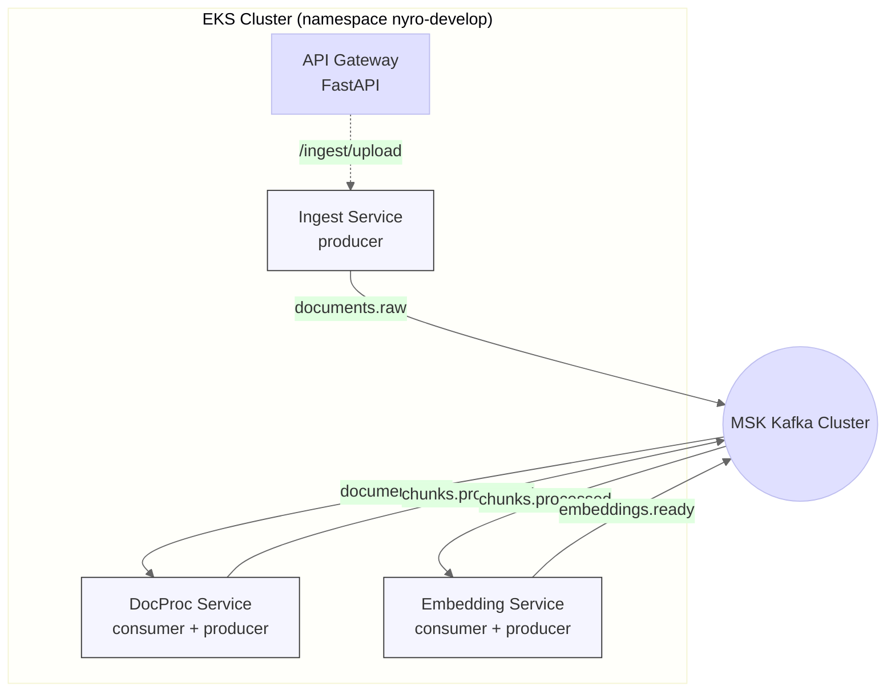

# Diagrama EKS

```mermaid
%%{init: { 'theme':'base', 'themeVariables': { 'primaryColor':'#e0e0ff', 'lineColor':'#666' }}}%%
flowchart TB
  subgraph "EKS Cluster (namespace nyro-develop)"
    direction LR
    AGW["API Gateway<br/>FastAPI"]
    IngestSvc["Ingest Service<br/>producer"]
    DocProcSvc["DocProc Service<br/>consumer + producer"]
    EmbSvc["Embedding Service<br/>consumer + producer"]
  end

  %% –– llamadas REST internas
  AGW -.->|/ingest/upload| IngestSvc

  %% –– Interacción con Kafka
  MSK((MSK Kafka Cluster))
  IngestSvc -- documents.raw --> MSK
  MSK -- documents.raw --> DocProcSvc
  DocProcSvc -- chunks.processed --> MSK
  MSK -- chunks.processed --> EmbSvc
  EmbSvc -- embeddings.ready --> MSK

  classDef svc stroke:#333,fill:#f5f5ff;
  class IngestSvc,DocProcSvc,EmbSvc svc;
```